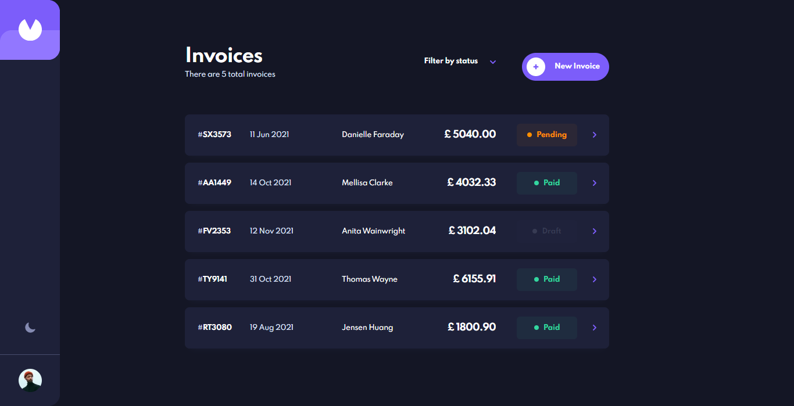

# Frontend Mentor - Invoice app solution

This is a solution to the [Invoice app challenge on Frontend Mentor](https://www.frontendmentor.io/challenges/invoice-app-i7KaLTQjl). Frontend Mentor challenges help you improve your coding skills by building realistic projects. 

## Table of contents

  - [Overview](#overview)
    - [The challenge](#the-challenge)
    - [Screenshot](#screenshot)
    - [Links](#links)
  - [My process](#my-process)
    - [Built with](#built-with)
    - [Useful resources](#useful-resources)
  - [Author](#author)

## Overview

### The challenge

Users should be able to:

- View the optimal layout for the app depending on their device's screen size
- See hover states for all interactive elements on the page
- Create, read, update, and delete invoices
- Receive form validations when trying to create/edit an invoice
- Save draft invoices, and mark pending invoices as paid
- Filter invoices by status (draft/pending/paid)
- Toggle light and dark mode
- **Bonus**: Keep track of any changes, even after refreshing the browser (`localStorage` could be used for this if you're not building out a full-stack app)

### Screenshot

### Links

- Solution URL: [GitHub Repository](https://github.com/funmilolajire/invoice-app)
- Live Site URL: [Invoice App | Home](https://invoice-app-nu.vercel.app/)

## My process

### Built with

- HTML5 & CSS3
- CSS custom properties
- [ReactJS](https://reactjs.org/) - JS library
- [NextJS](https://nextjs.org/) - React framework
- [NestJS](https://nestjs.com/) - Nodejs framework
- [MongoDB](https://www.mongodb.com/) - NoSQL database
- [Mongoose](https://mongoosejs.com/) - ODM for mongodb and nodejs
- [Formik](https://formik.org/) - Form library for react
- [React Datepicker](https://reactdatepicker.com/) - Datepicker component for react
- [Hookstate](https://hookstate.js.org/) - State management library for react

### Useful resources

- [Deploy NestJS typescript app to Heroku (Solved: 503 Error)](https://dev.to/rosyshrestha/deploy-nestjs-typescript-app-to-heroku-27e) - Helped me understand the 503 error I was getting on heroku and solve it.
- [Refreshing Server-Side Props](https://www.joshwcomeau.com/nextjs/refreshing-server-side-props/) - Useful tip on how to refresh server-side props after updating data on the server.
- [Persist Formik State on Refresh with React Hooks](https://www.lightpohl.me/blog/persist-formik-state-on-refresh-with-react-hooks) - Helped me persist the app's form state on refresh.

## Author

- Website - [Funmilola O.](https://funmilolajire.netlify.app/)
- Frontend Mentor - [@Erinay0](https://www.frontendmentor.io/profile/Erinay0)
- Twitter - [@funmilolajire](https://www.twitter.com/funmilolajire)  
